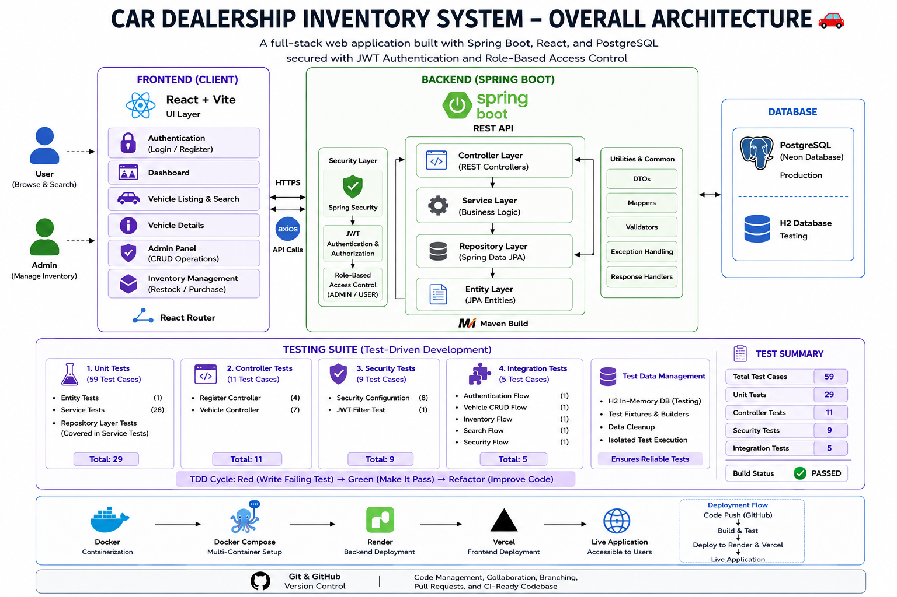
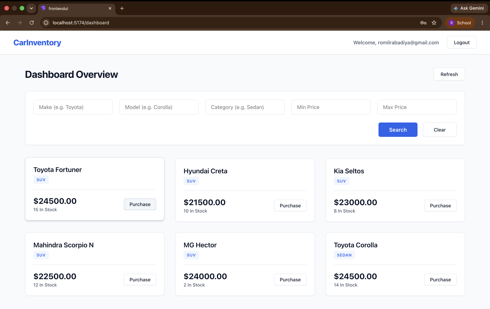
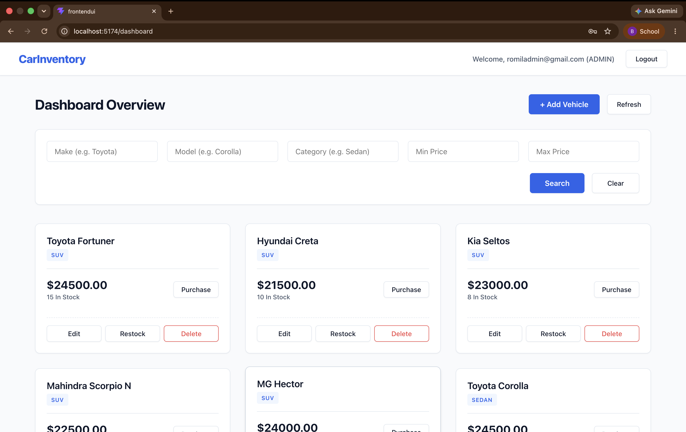
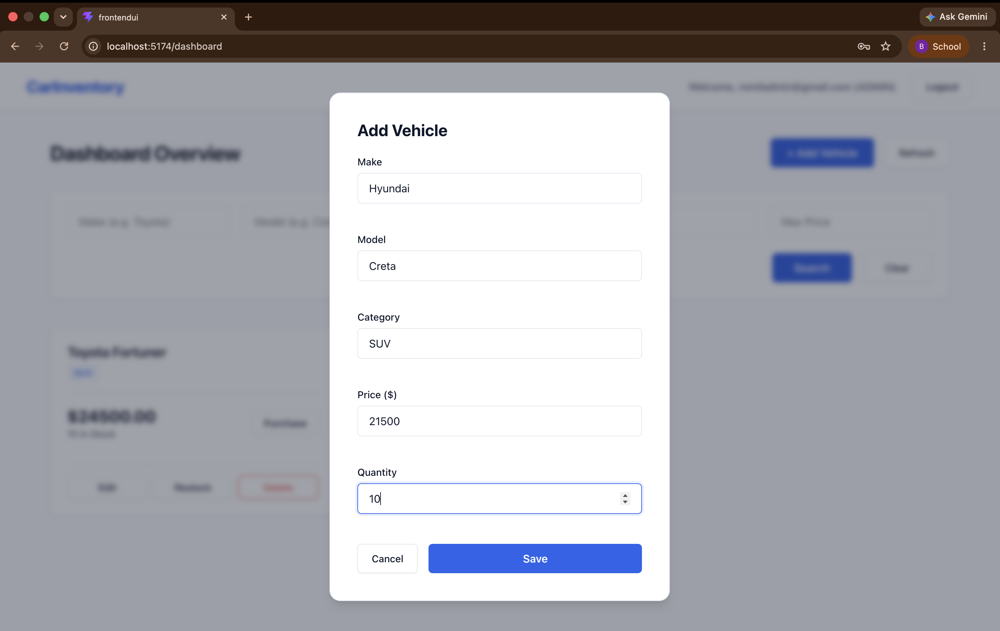
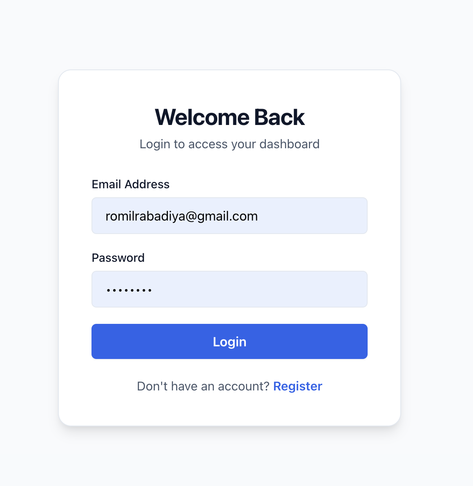
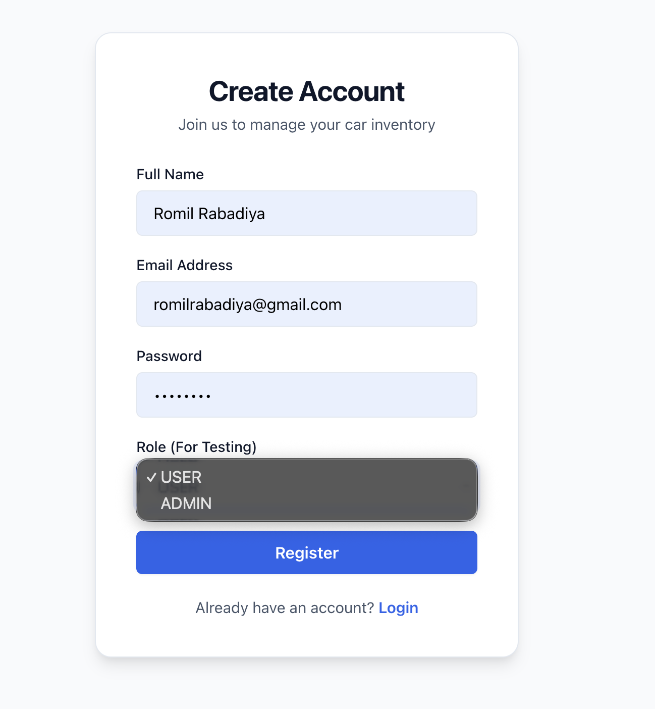

# Car Dealership Inventory System 🚗

A full-stack web application designed for car dealerships to manage their vehicle inventory, handle restocking and purchasing, and authenticate users/administrators. Built with **Spring Boot** for the backend API and **React + Vite** for the frontend UI.

<p align="center">
  
</p>

---

## 📖 Project Overview

The Car Dealership Inventory System allows dealerships to keep track of their cars. It features role-based access control where regular users can browse and search vehicles, and administrators can manage inventory (add, update, delete, and restock vehicles).

### Features:
- **Authentication & Authorization**: Secure login and registration using JWT (JSON Web Tokens). Role-based routing (Admin vs User).
- **Vehicle Management**: Full CRUD (Create, Read, Update, Delete) operations for car inventory.
- **Inventory Tracking**: Stock management, restocking capabilities, and purchase flows.
- **Search & Filtering**: Search cars by make, model, category, and price range.
- **Test-Driven**: Extensive test coverage (Unit, Integration, Security) written using TDD principles. 


## 🛠️ Technologies Used

### Backend
- **Java 21** & **Spring Boot 3.5.4**
- **Spring Security** & **JWT** for Authentication
- **Spring Data JPA** & **Hibernate**
- **PostgreSQL** (Neon Database) for Production / **H2** for Testing
- **Maven** for Dependency Management
- **JUnit 5 & Mockito** for Testing

### Frontend
- **React 19**
- **Vite** as the build tool
- **React Router** for client-side routing
- **Axios** for API calls
- **Sonner** for toast notifications

---

## 🚀 Setup & Installation Instructions

Follow these instructions to run both the Backend API and the Frontend UI locally.

### 1. Prerequisites
- **Java 21** installed (`java -version`)
- **Maven** installed (or you can use the included wrapper `./mvnw`)
- **Node.js** (v18+) and **npm** installed
- **Docker** (optional, if you want to run the backend via Docker)


### 2. Backend Setup (Spring Boot)

1. Navigate to the Backend directory:
   ```bash
   cd BackendAPI
   ```
2. Create your `.env` file:
   Make a copy of `application.properties` variables or create a `.env` file in the root of the `BackendAPI` folder with your database and JWT secrets:
   ```env
   DATABASE_URL=jdbc:postgresql://<your-db-url>
   DATABASE_USERNAME=<your-username>
   DATABASE_PASSWORD=<your-password>
   JWT_SECRET=<your-long-secure-jwt-secret>
   ```
3. Run the application:
   Using Maven:
   ```bash
   ./mvnw spring-boot:run
   ```
   *Alternatively, using Docker:*
   ```bash
   docker build -t backendapi .
   docker run --env-file .env -p 8080:8080 backendapi
   ```
   The backend will be running at `http://localhost:8080`.

### 3. Frontend Setup (React)

1. Navigate to the Frontend directory:
   ```bash
   cd FrontendUI
   ```
2. Install dependencies:
   ```bash
   npm install
   ```
3. Configure Environment Variables:
   Create a `.env` file in the `FrontendUI` folder (if it doesn't exist) to point to your local backend:
   ```env
   VITE_API_URL=http://localhost:8080/api
   ```
4. Start the development server:
   ```bash
   npm run dev
   ```
   The frontend will be accessible at `http://localhost:5173` (or the port specified by Vite in the terminal).

---


## 🧪 Testing

This project follows Test-Driven Development (TDD).

The test suite includes:

- Unit Tests
- Integration Tests
- Security Tests
- Controller Tests
- Repository Tests

For complete details, test cases, execution results, and screenshots, see:

👉 **[TEST_REPORT.md](TEST_REPORT.md)**

---

## 🤖 My AI Usage

### Overview

Throughout the development of this project, I used multiple AI tools as development assistants to improve productivity, validate ideas, and accelerate implementation. Each tool served a different purpose during the software development lifecycle.

All AI-generated suggestions were manually reviewed, modified where necessary, and verified through testing before being integrated into the project.

---

### AI Tools Used

#### 💡 Claude (Anthropic)

Claude was primarily used during the **planning and design phase** of the project.

I used Claude for:

- Designing the overall project architecture.
- Breaking the project into development modules.
- Planning the complete TDD roadmap.
- Designing professional test case descriptions.
- Creating product-level test scenarios.
- Planning the overall project workflow and feature implementation order.

---

#### 💻 ChatGPT (OpenAI)

ChatGPT was primarily used during the **implementation phase**.

I used ChatGPT for:

- Implementing Test-Driven Development (TDD).
- Implementing unit, controller, and integration test cases.
- Implementing backend features in Spring Boot.
- Docker and Docker Compose guidance.
- Deployment guidance (Render, Vercel, AWS EC2).
- Explaining Spring Boot, Spring Security, JWT, and software engineering concepts.

---

#### 🚀 Antigravity

Antigravity was mainly used during the **refactoring and debugging phase**.

I used Antigravity for:

- Refactoring the codebase after TDD implementation.
- Improving frontend implementation.
- Resolving compilation and integration issues.
- Fixing import statements and project-wide dependency issues.
- Debugging errors encountered during integration testing.
- Assisting in resolving complex runtime and configuration problems.

Since integration testing introduced multiple dependency and configuration issues, Antigravity was particularly helpful in identifying and resolving those problems efficiently.

---

#### 📖 Google Gemini

Gemini was primarily used for documentation.

I used Gemini for:

- Improving project documentation.
- Organizing the README structure.
- Assisting in writing the Test Report.
- Reviewing technical documentation for clarity and readability.

---

### Human Verification

Even though AI helped speed things up, I was always the one in charge. 

Before using any code the AI suggested, I made sure to:

- Read and understand the code.
- Tweak it to fit the project's exact needs.
- Double-check that it actually works.
- Run all my tests.
- Test the app myself, both on my computer and live on the internet.
- Clean up the code so it's easy to read and maintain.

Nothing went into this project without me personally checking it first.

---

### Reflection

Having AI as a coding assistant saved me a lot of time on boring tasks and helped me find bugs faster. Because of this, I was able to spend more time focusing on the big picture—like designing a good system, writing clean code, and making sure my tests were solid—while still completely owning the final product.

---

## 📸 Screenshots

### Customer Dashboard
<p align="center">
  
</p>

### Admin Dashboard
<p align="center">
  
</p>

### Add Vehicle Form (Admin)
<p align="center">
  
</p>

### Login Page
<p align="center">
  
</p>

### Register Page
<p align="center">
  
</p>
