# 🧪 Test Report

# Car Dealership Inventory System


---

# Test Overview

This project follows the **Test-Driven Development (TDD)** methodology using the **Red → Green → Refactor** cycle.

Every feature was implemented by first writing failing tests, followed by production code, and finally refactoring while ensuring all tests continued to pass.

The testing strategy validates every application layer independently and also verifies complete application workflows through integration testing.

---

# Testing Stack

| Framework | Purpose |
|-----------|----------|
| JUnit 5 | Unit Testing Framework |
| Mockito | Mocking Dependencies |
| Spring Boot Test | Integration Testing |
| MockMvc | REST Controller Testing |
| Spring Security Test | Security Testing |
| PostgreSQL Test Database | Persistence Testing |

---

# Test Statistics

| Category | Count |
|----------|------:|
| Entity Tests | 1 |
| Service Tests | 28 |
| Controller Tests | 11 |
| Security Tests | 9 |
| Integration Tests | 5 |
| **Total Test Cases** | **59** |

---

# Test Modules

---

# 1. Authentication Testing

Authentication functionality is validated through unit, controller, security, and integration tests.

## RegisterServiceTest

### Purpose

Verifies user registration business logic including validation, password encryption, duplicate email detection, and role assignment.

### Covered Test Cases

| Test Case | Description | Status |
|-----------|-------------|--------|
| TC-001 | Register user successfully | ✅ |
| TC-002 | Reject duplicate email | ✅ |
| TC-003 | Encrypt password before saving | ✅ |
| TC-004 | Assign USER role | ✅ |
| TC-005 | Return response DTO | ✅ |
| TC-006 | Reject null request | ✅ |

### Evidence

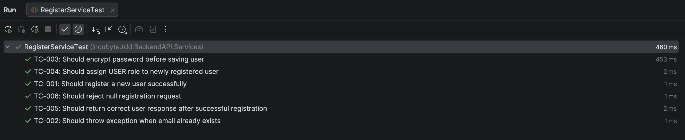

---

## RegisterControllerTest

### Purpose

Validates Registration REST API using MockMvc.

### Covered Test Cases

| Test Case | Description | Status |
|-----------|-------------|--------|
| TC-007 | Registration returns HTTP 201 | ✅ |
| TC-008 | Invalid request returns HTTP 400 | ✅ |
| TC-009 | Validation errors returned correctly | ✅ |
| TC-010 | Duplicate email returns HTTP 409 | ✅ |

### Evidence

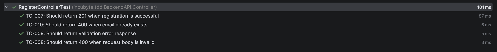

---

## LoginServiceTest

### Purpose

Verifies login authentication logic.

| Test Case | Description | Status |
|-----------|-------------|--------|
| TC-011 | Successful login | ✅ |
| TC-012 | Email not found | ✅ |
| TC-013 | Invalid credentials | ✅ |

### Evidence

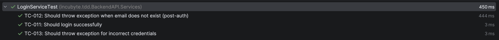

---

## JwtServiceTest

### Purpose

Verifies JWT generation and validation.

| Test Case | Description | Status |
|-----------|-------------|--------|
| TC-014 | Generate JWT | ✅ |
| TC-015 | Extract username | ✅ |
| TC-016 | Validate JWT | ✅ |
| TC-017 | Reject expired JWT | ✅ |
| TC-018 | Reject malformed JWT | ✅ |

### Evidence

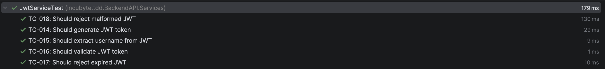

---

## CustomUserDetailsServiceTest

### Purpose

Verifies Spring Security user loading.

| Test Case | Description | Status |
|-----------|-------------|--------|
| TC-019 | Load user successfully | ✅ |
| TC-020 | Throw UsernameNotFoundException | ✅ |

### Evidence

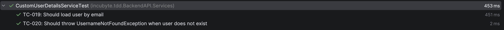

---

# 2. Security Testing

Spring Security configuration is verified using real authentication filters.

## SecurityIntegrationTest

### Purpose

Ensures protected endpoints enforce authentication and authorization rules.

| Test Case | Description | Status |
|-----------|-------------|--------|
| TC-021 | Public registration endpoint | ✅ |
| TC-022 | Reject request without JWT | ✅ |
| TC-023 | Allow authenticated request | ✅ |
| TC-024 | JWT Authentication Filter | ✅ |
| TC-025 | Allow request with valid JWT | ✅ |
| TC-026 | USER cannot delete vehicle | ✅ |
| TC-027 | ADMIN can delete vehicle | ✅ |
| TC-028 | USER cannot restock | ✅ |
| TC-029 | ADMIN can restock | ✅ |

### Evidence

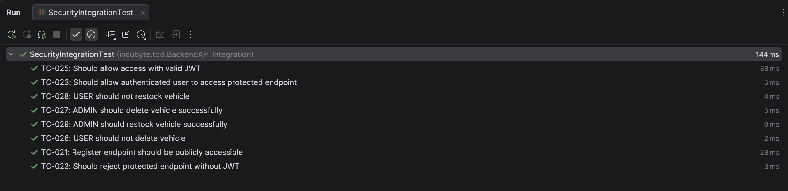

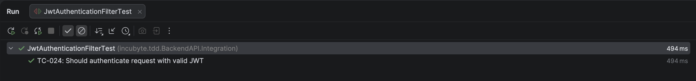

---

# 3. Vehicle Domain Testing

## VehicleTest

### Purpose

Validates Vehicle entity construction and domain model integrity.

| Test Case | Description | Status |
|-----------|-------------|--------|
| TC-030 | Create vehicle successfully | ✅ |

### Evidence

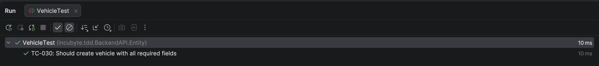

---

# 4. Vehicle Service Testing

Business rules for vehicle management are validated independently.

| Test Case | Description | Status |
|-----------|-------------|--------|
| TC-031 | Add vehicle | ✅ |
| TC-032 | Reject duplicate vehicle | ✅ |
| TC-033 | Get all vehicles | ✅ |
| TC-034 | Search by make | ✅ |
| TC-035 | Search by model | ✅ |
| TC-036 | Search by category | ✅ |
| TC-037 | Search by price range | ✅ |
| TC-038 | Update vehicle | ✅ |
| TC-039 | Delete vehicle | ✅ |

### Evidence

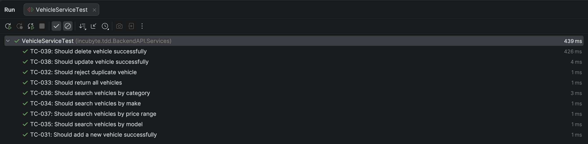

---

# 5. Inventory Testing

Inventory business rules are verified independently.

| Test Case | Description | Status |
|-----------|-------------|--------|
| TC-040 | Restock vehicle | ✅ |
| TC-041 | Reject non-existing vehicle | ✅ |
| TC-042 | Reject invalid quantity | ✅ |
| TC-043 | Purchase vehicle | ✅ |
| TC-044 | Reject purchase when stock is zero | ✅ |
| TC-045 | Reject purchasing unknown vehicle | ✅ |

### Evidence

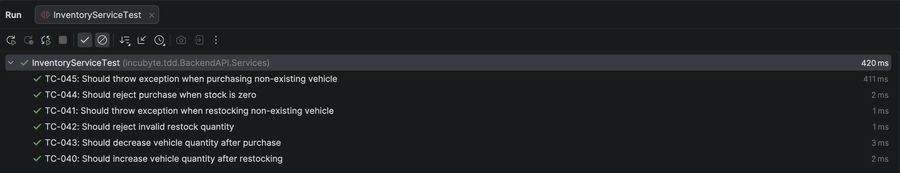

---

# 6. Vehicle Controller Testing

REST API endpoints are validated using MockMvc.

| Test Case | Description | Status |
|-----------|-------------|--------|
| TC-048 | Create vehicle | ✅ |
| TC-049 | Update vehicle | ✅ |
| TC-050 | Delete vehicle | ✅ |
| TC-051 | Get all vehicles | ✅ |
| TC-052 | Search vehicles | ✅ |
| TC-053 | Purchase vehicle | ✅ |
| TC-054 | Restock vehicle | ✅ |

### Evidence

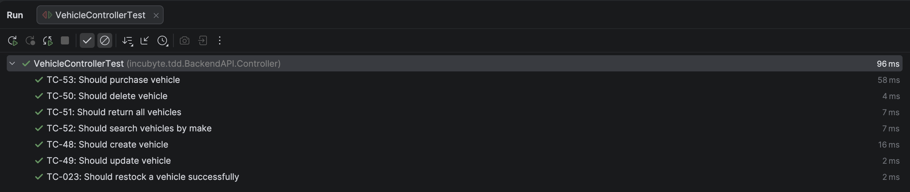

---

# 7. Integration Testing

Integration tests verify complete business workflows by loading the full Spring Boot application context, database, security configuration, repositories, services, and controllers.

---

## Authentication Workflow

```
Register
    │
    ▼
Login
    │
    ▼
Generate JWT
    │
    ▼
Access Protected API
```

**Covered Test**

- TC-055

Evidence

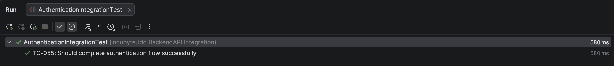

---

## Vehicle CRUD Workflow

```
Create
   │
   ▼
Retrieve
   │
   ▼
Update
   │
   ▼
Delete
```

**Covered Test**

- TC-056

Evidence

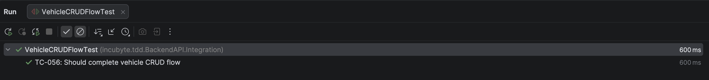

---

## Inventory Workflow

```
Create Vehicle
      │
      ▼
Restock
      │
      ▼
Purchase
      │
      ▼
Verify Stock
```

**Covered Test**

- TC-057

Evidence

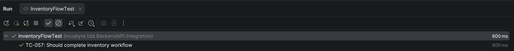

---

## Search Workflow

```
Create Vehicles
       │
       ▼
Search
       │
       ▼
Verify Results
```

**Covered Test**

- TC-058

Evidence

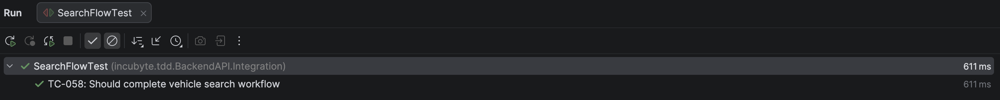

---

## Security Workflow

```
Protected API
      │
      ▼
Without JWT
      │
      ▼
401 Unauthorized
      │
      ▼
With JWT
      │
      ▼
200 OK
      │
      ▼
Role Verification
```

**Covered Test**

- TC-059

Evidence


---

# Test Execution Summary

| Module | Result |
|---------|--------|
| Authentication | ✅ Passed |
| JWT | ✅ Passed |
| Security | ✅ Passed |
| Vehicle CRUD | ✅ Passed |
| Inventory | ✅ Passed |
| Search | ✅ Passed |
| REST Controllers | ✅ Passed |
| Integration Workflows | ✅ Passed |

---

# Overall Result

| Metric | Result |
|---------|--------|
| Development Methodology | Test-Driven Development (TDD) |
| Testing Framework | JUnit 5 + Mockito + Spring Boot Test |
| Total Test Cases | **59** |
| Individual Test Suites | **15** |
| Integration Workflows | **5** |
| Build Status | ✅ Passed |
| Authentication | ✅ Verified |
| Authorization | ✅ Verified |
| CRUD Operations | ✅ Verified |
| Inventory Management | ✅ Verified |
| Search Functionality | ✅ Verified |
| Spring Security | ✅ Verified |

---

# Coverage Summary

The implemented test suite verifies:

- ✅ Entity Layer
- ✅ Service Layer
- ✅ Controller Layer
- ✅ JWT Authentication
- ✅ Spring Security Configuration
- ✅ Role-Based Authorization
- ✅ Vehicle CRUD Operations
- ✅ Inventory Management
- ✅ Vehicle Search
- ✅ Complete Integration Workflows

---

# Conclusion

The application successfully passes all implemented unit, controller, security, and integration tests. The testing strategy ensures that individual components behave correctly in isolation while also validating complete business workflows through end-to-end backend integration testing. This provides confidence that the application is reliable, maintainable, and ready for production deployment.
